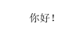
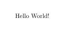
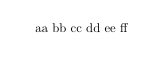
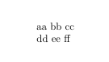
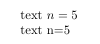
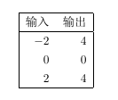

# LaTeX
## 发展历史
> `Tex`
>   - 字符串替换
>   - 宏语言  

> `LaTex`
>   - 宏命令
>   - 格式语言

## 命令 texdoc
> 文档查看

## 社区交流
> Stack Overflow  
> LaTeX工作室

# 正式部分
## 结构化文档
> 内容

## 文档编写
> 不需要在意格式化

## Markdown 与 LYX

## 文档部件
标题：\title, \author, \date, \maketitle  
摘要/前言：abstract 环境/ \chapter*  
目录：\tableofcontents  
章节：\chapter, \section, ...  
附录：\appendix + \chapter 或 \section, ...  
文献：\bibliography  
索引：\printindex  

## 文档划分
大型文档：\frontmatter，\mainmatter, \backmatter
一般文档：\appendix

### 章节层次
| 层次 | 名称 | 命令 | 说明 |
| - | - | - | - |
| -1 | part | \part | 可选的最高层 |
| 0 | chapter | \chapter | report, book 类最高层 |
| 1 | section | \section | article 类最高层 |
| 2 | subsection | \subsection |  |
| 3 | subsubsection | \subsubsection | report, book 类，默认不编号、不编目录|
| 4 | paragraph | \paragraph | 默认不编号、不编目录 |
| 5 | subparagraph | \subparagraph | 默认不编号、不编目录 |

## 磁盘文件组织
文件目录结构：
- 主文档，给出文档框架结构
- 按内容章节划分不同的文件
- 使用单独的类文件和格式文件设置格式
- 用小文件隔离复杂的图表

相关命令：
- \documentclass；读入文档类文件（.cls）
- \usepackage: 读入一个格式文件――宏包（.sty）
- \include；分页，并读入章节文件（.tex）
- \input：读入任意的文件

文档框架示例
```LaTex
% langage-main.tex  
\documentclass{book}  
\usepackage{makeidx}  
\makeindex  
\title{Languages}  
\author{someone}  
\begin{documet}  
\frontmatter  
\maketitle  
\tableofcontents  
\mainmatter  
\include{intro}  
\include{class}  
\backmatter  
\include{appendix}  
\bibliography{foo}  
\printindex  
\end{document}

% intro.tex
\part{Introduction}
  \chapter{Background}

% class.tex
\part{Classification}
  \chapter{Natural Language}
  \chapter{Computer Languages}
    \section{Machine Languages}
    \section{High Level Languages}
      \subsection{Compiled Language}
      \subsection{Interpretative Language}
      \subsubsection{Lisp}
        \paragraph{Common Lisp}
        \paragraph{Scheme}
      \subsubsection{Perl}

% appendix.tex
\chapter{Appendix}
```

# 填写文档内容
## LaTeX基础
```LaTex
\documentclass{ctexart}  
\begin{document}  
你好！
\end{document}
```


```LaTex
\documentclass{article}  
\begin{document}  
Hello World!
\end{document}
```


## 具体编译
> 英文推荐 pdflatex  
> 中文推荐 xelatex

## 语法结构
相对固定的形式
- 命令：参数总在后面花括号表示，用中括号表示可选参数
  ```LaTeX
  \cmd{arg1}{arg2}\\  
  \cmd[opt]{arg1}{arg2}  
  LaTeX的分数1/2 \frac{1}{2}  
  Tex的分数1/2 \over 2
  ```
- 环境 
  ```LaTeX
  \begin{env}  
    ...
  \end{env}
  LaTeX的矩阵 \begin{matrix} ... \\ ... \end{matrix}  
  Tex的矩阵 \matrix{...\cr ...\cr}
  ```

## 命令与环境
**命令**
```LaTeX
\em abc
\emph{abc}
```
**环境**
```LaTeX
\begin{env}
  环境内容
\end{env}
```
例如：
```LaTeX
\begin{flushright}
文字
\end{flushright}
```

## 正文文本
> 空格分开单词

```LaTeX
\documentclass{article}  
\begin{document}  
aa bb cc
dd ee ff
\end{document}
```


```LaTeX
\documentclass{article}  
\begin{document}  
aa bb cc

dd ee ff
\end{document}
```


## 正文符号
一些符号被 `LaTeX` 宏语言占用，需要以命令形式输入：
```LaTex
\# \$ \% \& \{ \}
\textbacklash
```
键盘上没有的符号用命令输入。
```LaTeX
\S \dag \ddag \P \copyright
\textbullet \textregistered
\texttrademark \pounds
```
更多的符号需要使用符号字体包。（查看 symbols 文档）

## 数学公式
一切数学公式（包括符号）都要在数学模式下输入。
示例：
```LaTeX
\documentclass{article}  
\begin{document}  
text $n=5$

text n=5
\end{document}
```

- 行内（inline）公式：使用一对符号$$来表示。
- 显示（display）公式。
    - 简单的不编号公式用命令\\[和\]\标示。（不要使用$$)
    - 基本的编号的公式用quation环境
    - 更复杂的结构，使用amsmath宏包提供的专门的数学环境。（不要使用eqnarray环境）

## 数学结构
- 上标和下标：用^和_标示。
- 上下划线与花括号：\overline,\underline,\overbrace,\underbrace
- 分式：\frac{分子}{分母}
- 根式：\sqrt[次数]{根号下}
- 矩阵：使用 amsmath 宏包提供的专门的矩阵环境 matrix，pmatrix，bmatrix等。特别复杂的矩阵（如带线条）使用array环境作为表格画出。

## 数学符号
- 数学字母a,b,α，数学字体\mathbb、\mathcal等
- 普通符号：如\infty，、angle
- 二元运算符：a+b，a-b等
- 二元关系符：a=b等
- 括号：\left，\right放大
- 标点：逗号、分好（\colon）

## 科技功能
**不要重复造轮子**
> amsmath 和 mathtools  
> siunitx：数字单位的一揽子解决方案  
> chemformula：编写化学式

## 列表环境
- enumerate 编号
- itemize 不编号
- description 有标题

## 定理类环境
- \newtheorem 定义定理类环境，如：\newtheorem{thm}{定理}[section]
- 使用定理类环境，如：
  ```LaTeX
  \begin{thm}
  一个定理
  \end{thm}
  ```

## 诗歌与引文
- verse
- quote
- quotation

## 抄录代码
- \verb 命令，如：
  ```LaTeX
  代码 \verb|#include <iostream>|
  ```
- verbatim
  ```LaTeX
  \begin{verbatim}
  #include <stdio.h>
  int main() {
      puts("Hello World!");
      return 0;
  }
  \end{verbatim}
  ```

## 高级代码：语法高亮
- 使用 listings 宏包
- minted 宏包（调用 Pygment）

## 算法结构
- clrscode 宏包（算法导论）
- algorithm2e 宏包
- algorithmicx 宏包的 algpseudocode 格式

## 画表格
使用 tabular 环境。
```LaTeX
\begin{tabular}{|rr|}
\hline
输入 & 输出 \\ \hline
$-2$ & 4 \\
0 & 0 \\
2 & 4 \\ \hline\
\end{tabular}
```


## 功能各异的表格宏包
- 单元格处理：multirow、makecell
- 长表格：longtable、xtab
- 定宽表格：xtabular
- 表现控制：booktabs（三线表）、diagbox（斜线表）、arydshln
- 表列格式：array
- 综合应用：tabu

## 插图
使用 graphicx 宏包提供的 \includegraphics 命令。
```LaTeX
\includegraphics[Width=2cm]{文件名}
```

## 代码画图
优先外部工具画图，特别是可视化工具（pdf格式），数学图形使用MATLAB等。  
使用合适的宏包，利用 `LaTeX` 代码画图。

## 浮动体
- figure 环境
- table 环境
- 其他环节可以使用 float 宏包
浮动体的标题用 \caption 命令得到，自动编号。

## 自动化工具
- 目录与交叉引用
- hyperref：PDF 的链接与书签
- 参考文献 BibTeX
- 设置文献格式
    - 选择合适的 `.bst` 格式
    - natbib 与作者-年格式
    - 利用 custom-bib 产生定制的格式文件
    - biblatex + Biber：文献处理的新方式

# 设计文档格式
## 基本原则
~~格式与内容要分离~~不要在意细节  

## 使用宏包
合理使用宏包：
- 尽量不造轮子
- 尽量排除不需要的宏包

## 格式控制功能

### 字体字号
字体
- \rmfamily, \textrm{...}
- \sffamily, \textsf{...}
- \ttfamily, \texttt{...}  
字号：\Huge, \LARGE, \Large, \large, 
\normalsize, \small, \footnotesize, 
\scriptsize, \tiny  
中文字号：\zihao{5}, \zihao{-3}

### 对齐
\centering, \raggedleft, \raggedright

### 空白间距
\hspace{2cm}, \vspace{3cm}

### 版面布局
geometry 宏包（纸张）
fancyhdr 宏包（版面）

### 分页断行
\linebreak, \\  
\pagebreak, \newpage, \clearpage, \cleardoublepage

### 盒子
\mbox{内容}  
\parbox{4em}{内容}, minipage

## 格式应用于文档

### 使用在导言区单独设置格式
预定义格式不符合需要。
- 直接设置相关参数。
- 修改部分命令定义。
- 利用工具宏包完成设置。

### 利用自定义命令和环境
可以使用自定义的命令和环境实现语义的接口。

### 章节标题
ctex 宏包及文档类，用 \ctexset 定制。